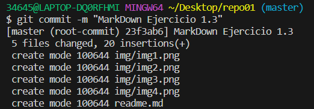

# CREANDO UN REPOSITORIO  
### 1. Abrir **Git Bash**  

  
***  
### 2.Buscar el **directorio**
#### Elige la ruta donde quieras crear la nueva carpeta.  
  
***  
### 3. Crear carpeta  
* #### Una vez hayas escogido la ruta utiliza el comando **$ mkdir** seguido del nombre de la nueva carpeta.  
     * Ejemplo: $ mkdir repo01
* #### Dirigete a la ruta de la nueva carpeta.  
* Convierte la carpeta en un repositorio por medio del comando **git init**.  
  
    
  ***
### 4. Abre el repositorio en VSC  
    
***   
### 1.3 Stagin area + commit (repositorio local) 
#### Añade el archivo a Staging area por medio del comando **"git add ."**
 
#### Crea un commit de las modificaciones de tu archivo en nuestro repositorio local por medio del comando **"git commit -m"**.
  
+ ¿En que "file status lifecycle" se encuentra el fichero?  
    + Al realizar stos comandos el archivo ha pasado de estar en el estado "untracked" a "Staged", luego, al "commitearlo" el archivo se consideraría "commited".  
***
### 1.4-8 Haz un git push y un git remote -v y crea una reposición remota

  
  

#### En un primer momento al realizar los comandos **git push** y **remote -v** el programa no los reconoce y no traslada el commit, ya que no se le ha indicado cual es el destino. Primero de todo tienes que crear una reposición remota en git hub y asociar el  repositorio remoto con el local por medio de los comandos que muestran las imagenes.  
***  
### 1.9 Git Hub 
  
Una vez asociados los repositorios vas a poder visualizar y editar los commits "pusheados". 

